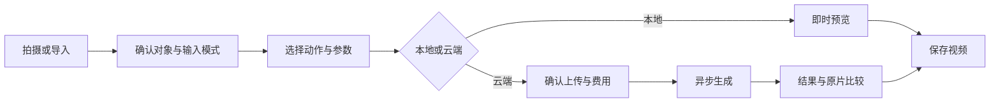

# 02 页面与交互

## 主流程

**拍摄/导入 → 选择对象 → 选择动作 → 预览/生成 → 调整 → 保存。**

首页用一句产品介绍说明价值，进入创作后用画面和操作反馈引导。内容无需选择故事、填写赠言或等待剧情结束。

| 页面 | 主要内容 | 退出与异常 |
|---|---|---|
| `#/camera` | 取景、拍照、导入、示例 | 不自动上传；离开释放相机 |
| `#/edit/:draftId` | 图片/视频确认、选区、动作卡、参数 | 保留原素材；修改使旧预览或报价失效 |
| `#/generate/:draftId` | 云上传范围、规格、额度确认 | 未配置时明确不可用，本地动作仍可选 |
| `#/jobs/:jobId` | 真实阶段和已等待时间 | 可离开回看；不确定提交保持核对状态 |
| `#/result/:workId` | 比较、播放、保存、返回编辑 | 原版本保留；云端重做是新任务 |
| `#/library` | 草稿、处理中、已完成作品 | 区分本地/云端有效期与存储状态 |

## 动作预设

| ID | 名称 | 对象/动作 | 参数与放行条件 |
|---|---|---|---|
| A01 | 呼吸 | 楼体立面内部轻微舒展 | 强度、周期；边界固定，无整体缩放 |
| A02 | 摇摆 | 树冠枝叶局部摆动 | 强度、速度；树干稳定，边缘无明显裂缝 |
| A03 | 点头/轻摆 | 路灯灯头轻转 | 优先云评测；灯杆与背景保真才开放 |

先 A01，其他逐一验收。雕像转头是后续候选，不作为首发必备。

## 模式的交互差异

本地模式参数变化即时改变原图运动。可选按住加强作为快捷操作，提供按钮替代；松开平滑恢复。此交互只控制强度，不触发剧情。首版默认恒定参数循环预览，用户可直接录制当前参数效果。

云模式在生成前设置动作/强度；生成后可以播放、比较、保存，修改动作需重新生成。不能把播放按钮包装成实时控制 AI 对象。为避免重复花费，参数改变先进入编辑状态，确认新报价后才提交。

## 视频与相机入口

视频输入先显示“处理这段视频”或“从这一帧生成”。前者只有实际视频路线验收后可用；后者让用户滑动选择一帧并明确丢弃原运动/声音。不能静默用选帧代替原视频处理。

实时取景首版是拍摄工具，预览上如显示本地画面辅助，需区分其与导出的冻结帧动画。连续画面跟踪与云实时效果未交付时不显示虚假的实时按钮。

## 动作预设契约

`id,version,title,objectTypes,supportedInputModes,supportedEngines,inputGuidance,motionParameters,renderPreset,generationInstruction,outputConstraints`。

快照包含输入哈希、裁剪/选区、动作版本、参数和渲染器版本。修改预设生成新版本，旧作品可追溯。云提示词描述原物体动作与保留要求，不要求自动生成字幕或角色故事。选区是目标提示，不等于模型支持精确局部编辑。

## 导出

常规导出固定参数的 6/10 秒循环；动画在 t=0 从确定相位开始，预览与导出共用渲染函数。若实现“录下按住交互”，另外记录事件轨迹并按实际录制时间回放，不改写成故事时间轴；首版可后置此功能。

导出结束展示实际文件回放，再进入作品库。没有强制片头/片尾，品牌标识可轻量可选，不遮挡对象。字幕不是默认必需图层。

## 可访问性与状态文案

长按有按钮/键盘替代，提供低动态强度。相机拒绝可导入，临时存储提示先下载，后台中断不能显示完整导出成功。

- 选帧：“只用这一帧生成动画，不保留原视频运动与声音。”
- 云前：“此素材将发送至所选视频服务；规格与消耗见本次确认。”
- 未知提交：“正在核对这次提交，请先不要重复创建。”
- 失败：“未生成成功，可查看原因或另选本地效果。”
- 不支持：“当前画面暂不适合这个动作，请调整选区或更换动作。”
