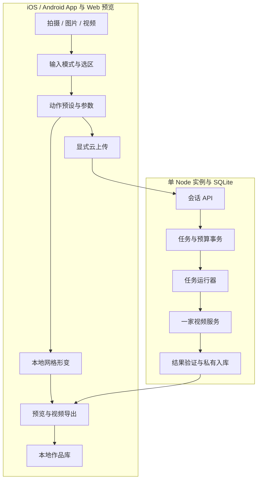

# 03 技术架构

目标架构及当前实现；验收边界见 [09](09-开发进度与证据.md)。开发目录：`Breathe-City-All-In-One/01-project/breathe-city/`，代码路径均相对于此。

## 保留的旧版模块与复用依据

| 模块 | 复用 | 新增或调整 |
|---|---|---|
| `media.js` | 相机、文件输入、资源释放、录制 | 方向/尺寸检查、选帧、视频选段、恢复 |
| `engine.js` | 画布与绘制循环 | 原图网格变形、参数控制、确定性导出 |
| `domain.js` | 比例映射 | 对象选区、动作预设和参数校验 |
| `segmentation*.js` | 异步分析接口 | 当前并非通用实例分割；MVP 手动选区 |
| `storage.js` | IndexedDB 作品 | 草稿、动作快照与版本迁移 |
| `app.js` | 编排 | 拆输入/选区/动作/作品控制器 |
| `server/store.mjs`、`worker.mjs` | 持久化和不确定提交处理思想 | 视频任务、会话归属、原子费用预留 |
| `providers.mjs` | 适配器模式 | 独立视频适配器 |
| `realtime.js`、`glb.js` | 保留实验能力 | 不作为新主流程的前置依赖 |

现有粒子/光效不等于原物体动画。43 项既有测试是旧原型基线，不证明新能力。

## 结构

邀请测试先用单实例加持久卷。API 异步返回任务 ID，不等待生成。多实例扩展前再引入数据库租约/队列，不直接多进程消费同一个任务表。

## 原物体运动实现

首个试验：真实立面局部形变，保持选区边界。

1. 方向校正后的原帧是唯一坐标基准，用户选多边形。
2. 区域内网格顶点按到边界距离加权，边界位移为零。
3. 呼吸位移由时间 t、强度、周期决定；初始幅度约主体宽度 1–2%，依实测调整。
4. 网格三角形采样原图，羽化边缘；出现网格翻折则限制幅度。
5. 光效可附加，但关掉它仍须看到原图物体运动。

先以现有 Canvas 做小网格，性能不足再改 WebGL。移动整块抠图会露背景洞，转头需要原图没有的侧面，简单形变无法解决。大动作需要背景补全或生成式视频，不能依靠提示词宣称解决遮挡。

## 三种输入的不同路径

**照片：** 拍摄/导入 → 规范化 → 选区 → 本地形变或图生视频。首个交付路径。

**视频：** 明确选择 video-frame 或 video-edit。前者在浏览器选一帧；后者保留视频帧序列，先支持固定机位的选区内逐帧形变，或者经过实测的云视频编辑。移动镜头需要跟踪，选区丢失即暂停效果并提示，不让旧选区漂移。通过固定机位不能宣称任意移动视频支持。

**连续相机：** 首版提供取景拍摄；后续增加跟踪/形变。相机流可用与 AR 跟踪可用分别验收。

## 云端生成

输入媒体 → 冻结动作与参数快照 → quote → submit → poll → 下载验证 → 私有入库 → 比较/保存。

首版图生视频整帧输入，选区用于描述目标。若模型无 mask 能力，不发虚构参数。输出保真依真实评测；裁剪物体再贴回会产生接缝/遮挡，不能当保真保证。

服务端取回结果只允许配置可信源，限制重定向、域名/IP、大小/耗时，拒绝本地与私有网络地址。结果实际解码入库后才成功；供应商临时 URL 不作为永久作品。

## 动作参数与导出

当前 `motion-domain.js` 定义动作/校验，`motion-renderer.js` 绘制，`studio-media.js` 负责录制。核心 `renderAt(t, source, settings, options)` 按绝对时间生成画面。预览与导出共用函数，随机过程固定 seed，避免帧累积导致不一致。

本地默认导出恒定参数的 6/10 秒动作，不插入剧情段落。交互录制可后置；若实现则按实际录制时间回放输入事件，不能替换成虚拟剧情进度。

MediaRecorder 输出实际格式由设备能力检测；云视频可直接下载验证后的原结果。若目标设备不支持当前输出分享，再评估固定参数、资源受限的服务端转码；未实现前不宣称全平台 MP4。页面隐藏中断导出，不把残片记成完整作品。

## 实际新增模块

前端：`studio.js` 编排界面；`studio-media.js` 输入/录制；`motion-domain.js` 动作/选区；`motion-renderer.js` 局部网格；`studio-store.js` 草稿/作品；`generation-client.js` 云会话和持久幂等提交。

服务端：`generation-app.mjs` HTTP/会话校验；`generation-store.mjs` SQLite 和额度事务；`media-store.mjs` 私有媒体、解码、下载限制与清理；`video-provider.mjs` Runway 适配；`generation-worker.mjs` 任务轮询/入库；`video-config.mjs` 配置；`data-lock.mjs` 单机写入锁。

`tools/data-backup.mjs` 离线备份与恢复到新目录。旧服务表在 breathe.sqlite，新表在 generation.sqlite。模块代表职责，文件数量不作为指标。没有 StoryRuntime 或剧情编排服务。

## 设计决策

| ID | 建议 | 原因与重评条件 |
|---|---|---|
| D01 | Ionic + Capacitor 双平台 App | 用户已确认安装版；Web 预览复用引擎，原生能力分别验收 |
| D02 | 照片先、受控视频再、连续相机后 | 逐步加入时间一致性与跟踪；若用户要求实时首发则重新估算 |
| D03 | 原生 JS 单体迭代 | 复用已有链路，出现明确维护问题后再迁框架 |
| D04 | 动作预设 | 用户不用写提示词，开放少量有效参数 |
| D05 | 一家视频供应商 | 用样本选择，避免三家同时集成 |
| D06 | Tripo 可选 | 只有多视角对象操控确需 3D 时再引入 |

实时阶段需单独测漂移、遮挡、目标丢失、重定位、端到端延迟与发热。云实时编辑与本地跟踪是不同能力，不能共用验收结果。
