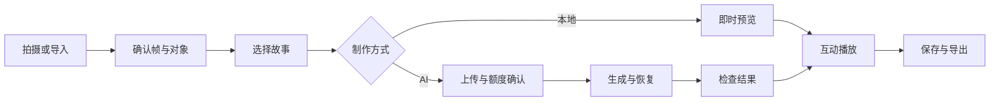

# 02 页面与故事

## 信息架构

主导航“发现 / 我的故事”，创作—制作—播放连续完成。先使用 hash 路由接入原生 JS；参数调试留在开发入口。

| 页面 | 内容与动作 | 异常和退出 |
|---|---|---|
| `#/discover` | 简介、拍摄、导入、示例 | 示例标记；不自动请求相机 |
| `#/capture` | 取景、快门、相册 | 拒绝权限可导入；离开停轨道 |
| `#/edit/:draftId` | 视频选帧、裁剪、选区、类别、故事卡 | 原帧保留；修改使旧预览失效 |
| `#/prepare/:draftId` | 本地预览；或云上传与额度确认 | 未配置云服务仍可选本地模式 |
| `#/jobs/:jobId` | 阶段、已等待时长、离开后回看 | 不编造百分比；不确定提交核对中 |
| `#/play/:workId` | 开场、动作、互动、结尾 | 隐藏暂停；重播不重新生成 |
| `#/library` | 草稿、处理中、作品 | 区分服务端和本机可恢复内容 |
| `#/work/:workId` | 比较、下载、重播、删除、重做 | 重做新建草稿，旧作品保留 |

## 主故事 S01：让楼宇松口气

适用：主体明确、基本正面、文字/行人较少的楼宇照片。手动标出立面，局部形变幅度小、选区边界固定。

| 阶段 | 文案 | 行为 |
|---|---|---|
| 发现，约 2 秒 | “它站了一整天。” | 原图，立面开始极轻呼吸 |
| 邀请，等待互动 | “陪它松一口气。” | 长按或按钮触发；8 秒无操作再提示，可主动选自动播放 |
| 回应，约 5 秒 | 累计长按 2 秒触发 | 立面舒展、窗光变暖；强度由本地输入变化 |
| 结尾，约 3 秒 | “今天，你也可以慢一点。” | 动作回落，显示保存入口 |

播放时长包含等待，不固定 10 秒。导出时间轴固定为开场 2 秒、回应 5 秒、片尾 3 秒。删除等待段；把互动事件映射到回应段，保留原始事件与映射版本。没有互动时用用户明确选择的自动版本。

## 扩展故事

| ID | 故事 | 原物体动作 | 交互与关口 |
|---|---|---|---|
| S02 | 树冠：“风走后，它还想伸个懒腰。” | 枝叶局部摆动/舒展 | 按住积累、松开回落；树干与边缘稳定 |
| S03 | 路灯：“它也想向你点个头。” | 灯头轻转或弯曲 | 轻触唤醒；优先 AI 评测，灯杆/背景保真才开放 |

雕像转头后置。若路灯不能保持原物体身份，关闭模板，不用单纯光晕冒充动作。

## 互动契约

本地：StoryRuntime 接收 holdStart/holdEnd/tap，实际改变形变幅度、光效与状态。

AI：先生成动作段，用户触发播放并影响本地字幕/光效；不会实时改写视频动作。文案“点亮这个故事”。MVP 不预生成多结局，不按每次触摸新建付费请求。

所有长按提供按钮替代，支持 Enter/Space。提供低动态强度，避免闪烁。字幕位于画幅安全区，保留原始对象主体。

## 模板字段（拟新增）

`id`、`version`、`title`、`objectTypes`、`supportedModes`、`inputGuidance`、`beats`、`interactionPolicy`、`motionPreset`、`generationInstruction`、`captionStyle`、`exportTimeline`。

模板改变新增版本，任务与作品保存快照。生成指令描述动作；字幕由应用叠加。用户赠言≤40 字，按文本渲染，不要求模型在画面中生成文字。

示例指令：固定镜头；所选建筑保持轮廓、窗格与材质，只产生一次轻微舒展；保留其他物体与文字，不添加新角色或镜头运动。选区是目标提示，不等于服务支持严格蒙版约束，实际仍需检查输出。

## 状态文案

- 视频选帧：“本次使用这一帧，不保留原视频运动和声音。”
- 上传前：“画面将发送给所选视频服务，消耗以本次确认信息为准。”
- 不确定提交：“正在核对这次提交，请先不要重新创建。”
- 失败：“本次未生成成功。可以查看原因，或另选本地故事。”
- 临时存储：“作品暂存在当前页面，请先下载。”
- 不适用：“这个动作暂不适合当前画面，请换照片或故事。”

云失败后切换本地必须由用户选择，不能改成虚假的成功状态。
