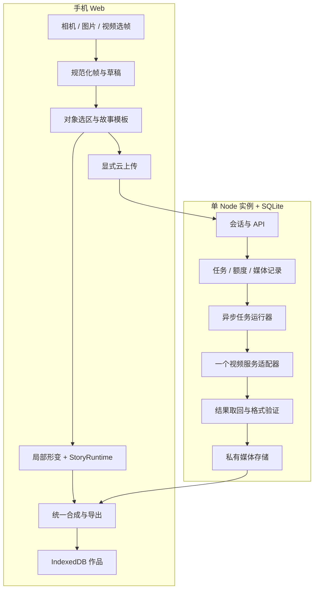

# 03 技术架构

状态：目标设计，尚未实现。开发根目录：`Breathe-City-All-In-One/01-project/breathe-city/`，本文代码路径相对此目录。

## 1. 当前资产与缺口

| 现有模块 | 可复用 | 必须新增/调整 |
|---|---|---|
| `public/js/media.js` | 相机、文件输入、资源释放、录制 | 选帧、输入尺寸检查、方向处理、导出恢复 |
| `engine.js` | 原图与合成画布、绘制循环 | 原图局部形变、确定性时间轴、字幕层 |
| `domain.js` | 比例映射、基础规则 | 对象选区与故事领域；规则仅作辅助 |
| `segmentation*.js` | 异步分析接口 | 现有语义类别不提供任意实例选取，MVP 手动框/多边形优先 |
| `storage.js` | IndexedDB Blob 保存 | 草稿、交互轨迹、模板快照与版本迁移 |
| `app.js` | UI 编排基础 | 按输入/选区/故事/作品拆控制器，避免继续膨胀 |
| `server/store.mjs`、`worker.mjs` | SQLite、幂等思想、不确定提交处理 | 新版视频任务与会话所有权、费用预留、媒体生命周期 |
| `server/providers.mjs` | 提交/查询适配模式 | 视频适配器独立实现；旧 Tripo/world 任务保留 |
| `realtime.js`、`glb.js` | 保留实验能力 | 不作为本版核心依赖 |

2026-09-21 既有自动测试通过；不代表上述新模块、真实设备或云服务已通过。

## 2. 系统结构

单实例服务配持久卷即可承载邀请测试，SQLite 与文件存储同机。公开多实例扩展前才引入队列租约和对象存储。API 不等待模型完成；任务运行器与 HTTP 职责分开，仍可同进程部署。

## 3. 本地原物体动作

首个技术试验是立面内部的边界固定网格形变：

1. 将校正方向后的原帧定义为唯一坐标空间。
2. 用户选立面多边形，矩形可作初始选区；多边形外维持原图。
3. 在选区内建立规则网格，以到边界距离计算权重，边界位移为零。
4. 位移函数由统一故事时间、强度、呼吸周期驱动；先只允许约主体宽度 1–2% 的小幅度，实际值通过画面验收确定。
5. 使用网格三角形采样绘制变形原图，羽化边缘；网格翻折时限制位移或提示降低强度。
6. 在独立层叠加窗光/字幕；光效不能替代 F04 的原图运动。

首版优先用浏览器现有 Canvas 能力做小网格试验；性能不达标再改 WebGL 网格。先测清楚是否需要迁移，不预先引入完整 3D 引擎。

移动整个物体会暴露背景缺口，转头会出现原图未包含的侧面。简单移动抠图无法解决这些问题。MVP 本地只做边界固定、小幅度动作；大动作走 AI 视频或另做背景补全与分层，不承诺从一张照片恢复完整几何。

## 4. AI 生成链路

规范化帧 → 服务端私有媒体 → 冻结模板/选区/动作/模型快照 → 异步 submit → poll → 下载结果 → 验证解码、时长、画幅 → 私有入库 → 用户质量检查 → 组合故事。

选区本身只参与目标描述；若模型无原生 mask 支持，不添加虚假的 mask 参数。默认整帧输入，提示目标位置与外观，输出可能改变背景，必须实测。先裁剪物体再贴回原图会有遮挡与接缝问题，不作为保真保证。

结果 URL 不能直接充当永久作品。服务端只从配置的可信源下载，验证重定向、域名与地址解析，拒绝本地/私有网段，限制字节与耗时；重新解码后提供同源媒体。浏览器下载失败、CORS 或链接过期不能把任务标成功。

## 5. 时间轴与导出

新增 `story-runtime.js` 负责纯状态转移，`story-renderer.js` 按 `renderAt(t, snapshot, interactions)` 绘制，`story-exporter.js` 驱动录制。预览与导出共用模板快照、字幕位置与运动公式。

本地实现不能直接依赖累计 requestAnimationFrame 时间，否则重播/导出不一致。随机变化使用固定 seed。交互以相对开始时间记录，导出时按 02 的规则映射，保留原轨迹。

首版用现有 MediaRecorder 路线录制统一画布。云视频要先实际可播放再绘制；录制期间页面隐藏则停止并标为中断，不把残片记成完整作品。输出编码按设备实测决定；通过验收的 MP4 可直接下载。只有 WebM 的设备若不能满足分享目标，则新增受限服务端转码任务，验收前不宣称通用 MP4。

服务端转码是可选实现分支：固定命令参数、独立临时目录、限制输入/资源/时长、退出失败不发布文件。是否引入 FFmpeg 由 M0 设备试验决定并记录版本；本次未安装。

## 6. 数据与模块边界

拟新增前端：`capture-controller.js`、`selection-editor.js`、`draft-store.js`、`story-runtime.js`、`story-renderer.js`、`story-exporter.js`、`generation-client.js`、`story-templates.js`。

拟新增服务端：`session-service.mjs`、`media-store.mjs`、`generation-service.mjs`、`video-provider.mjs`、`result-ingest.mjs`、`migrations/`。可先在这些边界内小规模实现，文件数量不作为验收要求。

核心依赖方向：UI → 故事应用服务 → 领域状态；媒体和云接口通过适配器进入。模板可被离线验证，不依赖网络和 DOM。状态与 API 详见 [04](04-接口与数据.md)。

## 7. 关键决策记录

| ID | 建议决策 | 原因 | 重新评估条件 |
|---|---|---|---|
| D01 | 手机 Web 先行 | 验证体验与分享入口 | 真机能力阻断核心闭环，再考虑原生 |
| D02 | 拍后单帧先行 | 降低跟踪和逐帧一致性成本 | F01–F10 成立后，再评测整段视频 |
| D03 | 原生 JS 单体迭代 | 现有链路可复用 | 团队维护成本出现证据后再迁框架 |
| D04 | 模板故事优先 | 控制叙事、费用、输出长度 | 足够模板与使用数据支持自由创作 |
| D05 | 只接一家视频服务 | 减少关键路径 | 对照评测显示硬性能力缺失 |
| D06 | Tripo 可选 | 当前目标是原物体动作 | 反复多视角交互需要对象 3D 化 |

## 8. 实时 AR 的后续关口

先做固定机位/慢移画面的目标跟踪，再做遮挡与目标丢失处理，最后考虑空间位姿。测移动后漂移、重定位、端到端延迟和持续发热。追踪失效时暂停特效并提示重选，不能让物体继续漂浮。

云实时编辑和本地 AR 跟踪是不同模块；是否用 Decart 需独立设备与网络评测。未实现前 UI 和参赛介绍使用“拍后互动故事”，不称已完成空间 AR。
