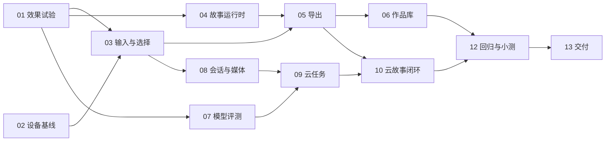

# 06 开发排期与任务

状态：以下全部待开发，不是已完成清单。估算 12–16 人日，前提是 1 名全栈主力可连续投入，内容与测试有人配合；模型等待、账号开通和素材授权可能增加日历时间。没有团队规模信息，具体负责人暂用角色表示。

## 1. 工作包

| 工单 | 需求 | 工作与完成证据 | 依赖 | 责任角色 | 人日 |
|---|---|---|---|---|---:|
| BC2-01 | F01/F04 | 真实楼宇素材与局部变形试验，输出原片/效果比较 | 无 | 开发+内容 | 1–1.5 |
| BC2-02 | F01/F06 | 两台目标手机输入、编码、下载基线，决定是否要转码 | 无 | 开发+测试 | 0.5 |
| BC2-03 | F01/F02 | 输入规范化、视频选帧、裁剪与选区编辑，草稿可恢复 | 01/02 | 前端 | 1.5 |
| BC2-04 | F03/F05 | 模板配置、StoryRuntime、长按/按钮/自动播放和事件记录 | 01 | 前端+内容 | 1 |
| BC2-05 | F04/F06 | 确定性合成、字幕、10 秒导出、后台中断处理 | 03/04 | 前端 | 1–1.5 |
| BC2-06 | F07/F08 | IndexedDB 迁移、作品回看/删除、临时存储提示 | 03/05 | 前端 | 0.5–1 |
| BC2-07 | F09 | 真实账号/预算与模型评测，锁定一家能力和版本 | 01；账号预算 | 开发+产品 | 1–1.5 |
| BC2-08 | F09 | 会话隔离、媒体上传验证、TTL、私有下载 | 03 | 后端 | 1 |
| BC2-09 | F09 | 报价、幂等、原子额度预留、submit/poll/reconcile | 07/08 | 后端 | 1.5–2 |
| BC2-10 | F09/F10 | 结果入库/恢复、生成状态 UI、比较、拒绝与重做 | 05/09 | 全栈 | 1 |
| BC2-11 | F11 | 第二/三故事与系统分享，逐模板筛选 | 05/07 | 内容+前端 | 0.5–1 |
| BC2-12 | F01–F11 | 设备与留出集回归、5–8 人小测、修阻断 | 06/10 | 开发+测试 | 1 |
| BC2-13 | 交付 | 运行包、受控体验入口、完整录屏、资产板、提交资料 | 12 | 全栈+产品 | 0.5 |

上表合计 12–15.5 人日，按 12–16 对外估算，不包含全面重构或原生 App。若需引入服务端转码，在 BC2-05 分支单独估算，优先删除扩展故事保障期限。

## 2. 依赖与关口

M0：9 月 22–23 日。先通过效果和设备试验；模型试验依实际授权开始。无法保真就缩动作，不堆 UI 掩盖问题。

M1：9 月 24–26 日。本地完整故事必须可交给别人操作；未通过就暂停云端扩展，把时间投入核心导出与互动。

M2：9 月 27–29 日。云端真实闭环、预算和恢复通过才展示入口。账号/效果/成本未通过，关闭云入口，保留本地参赛版本并明确交付差异。

M3：9 月 30 日–10 月 1 日。冻结模型与模板；两台手机与陌生用户测试，决定是否保留扩展故事。

M4：10 月 2–3 日。只修阻断问题，整理录屏和体验入口；10 月 4 日作为内部提交目标，避免依赖时区边界。

上述日期要求冲刺期连续可用；若按普通工作日且遇休假，不应把 12–16 人日压成必然按期。

## 3. 缩减顺序

第一层：删除 S03、S02、系统分享、声音，仅保留 S01 与下载。

第二层：云服务效果/预算不过关时关闭 AI 模式，交付本地原物体互动故事；明确 F09/F10 未完成。

第三层：输入保留照片拍摄/导入，视频选帧后置；这是需求变更，更新 PRD 和提交说明，不能仍宣称视频输入已交付。

不能删除的核心：原物体真实运动、清楚的故事与回应、可操作 Demo、至少一条可播放视频导出链路。若这些未通过，状态保持未完成。

## 4. 开发执行约定

按工作包交付小改动，每包关联需求编号、源码位置、验证记录与遗留项。先看当前工作区和现有差异，再修改；不覆盖用户未提交内容。运行适合本次变更的测试，复杂状态用边界测试；文档或样式调整不编写镜像实现的无效测试。

每个工单完成条件：实际代码、对应验收结果、错误恢复、文档更新齐备。涉及模型时额外保存可脱敏的请求配置、真实 task ID 与样本证据；没有这些只算适配器实现，不算供应商验收。

## 5. 待决策记录

| 项目 | 当前建议 | 最晚决定时点 | 未决定时处理 |
|---|---|---|---|
| 拍后 vs 实时优先 | 拍后 | M0 | 本计划按拍后；若必须实时，重新估算，不隐式混入 |
| 目标手机 | 1 台 iPhone + 1 台 Android | BC2-02 | 可开发桌面基线，手机仍标未验收 |
| 视频供应商/账号 | 一家已有可用账户的候选 | BC2-07 | 使用模拟器，仅本地功能开放 |
| 预算 | 单次/每日/总额明确 | 真调用前 | 付费关闭 |
| 三个故事还是一个 | 一个保底 | M3 | 保留 S01 |
| 部署与邀请方式 | 单实例 HTTPS 邀请体验 | M2 前 | 本地运行，不冒充公开可访问 |
| 工具赛道 | 暂不选 | 提交前 | 根据真实工具贡献重新评估 |
